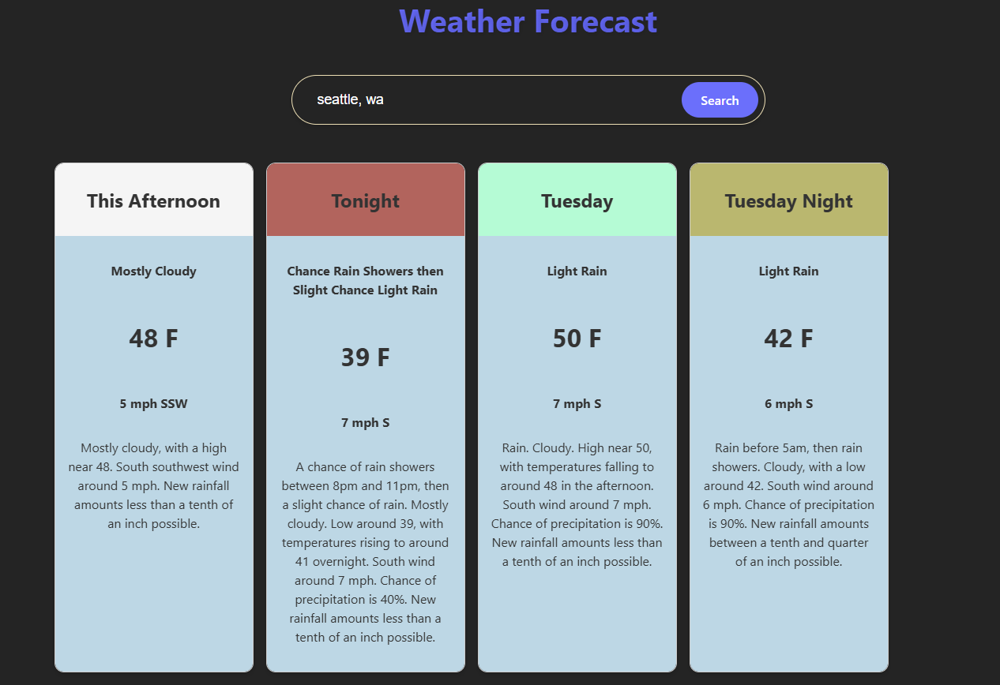
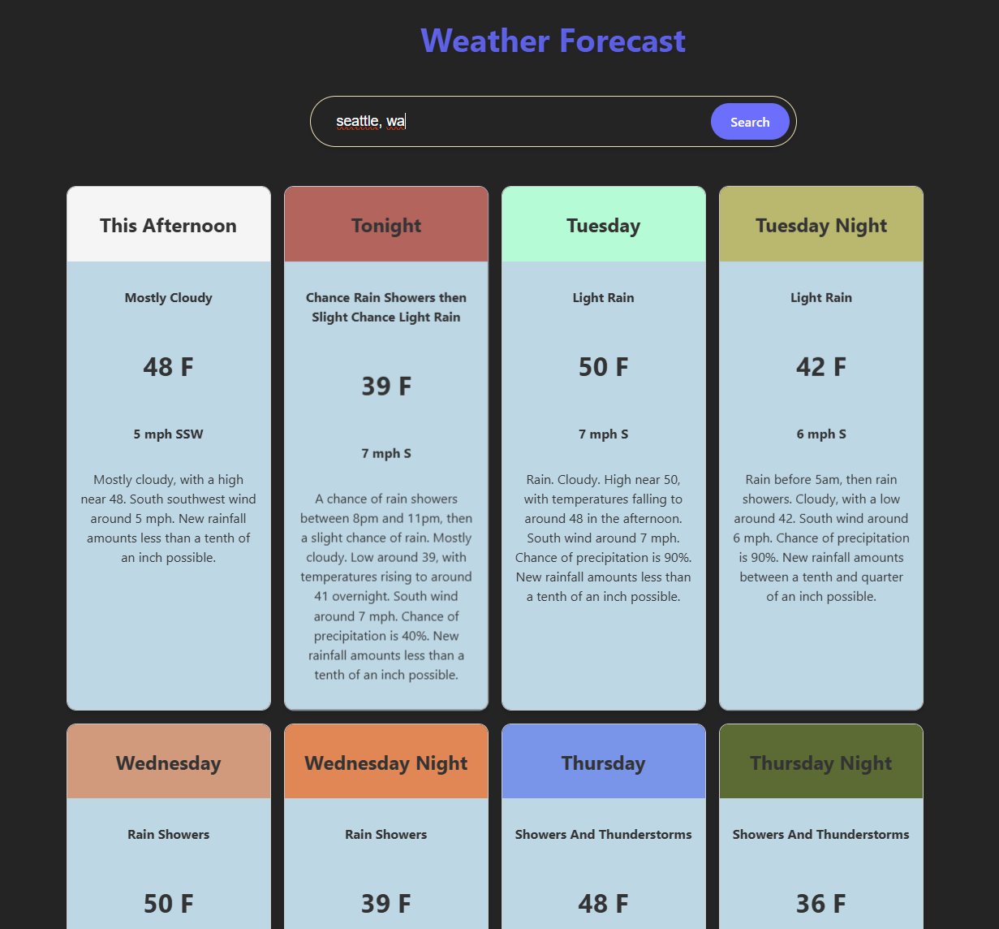

# React Weather App

A rudementary weather forecasting app based on [weather.gov](https://www.weather.gov/documentation/services-web-api) data.

The app is displaying a configurable numbers of WeatherCard components, one for each forecast period .  Each period is defined as night or day of the current date and the next few dates (up to 14 periods).

The location search is rudementary - just to make it easy to look up a location based on "city, state" (must be strictly in that format).  The current implemtation is based on the lookup of the weather stations (from weather.gov) and find the first station matching the `city` and get its latitude and longitude.

The weather.gov's weather info for a particular location is defined by its latitude and longitude.  This can be incorporated by using a service like [Google Geop API](https://developers.google.com/maps/documentation/geocoding/overview) - and it requires an API key.

Use and update as necessary!

